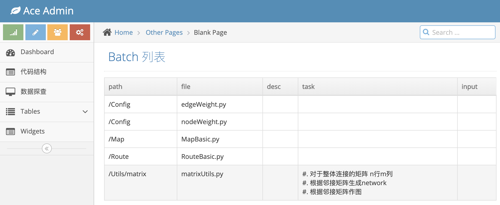

# rudi_code_structure_ui

This Project is use to show code structure of a dedicate folder.  


You need to add the path which u wang to inspect like this: http://127.0.0.1:8000/inspector?path=/xxx/xxxx 


With comment start with following tags, content will be display at page http://127.0.0.1:8000/inspector 

```
# desc
# task
# input
```



This project is still under developing.
